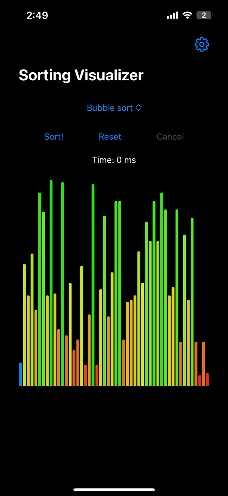
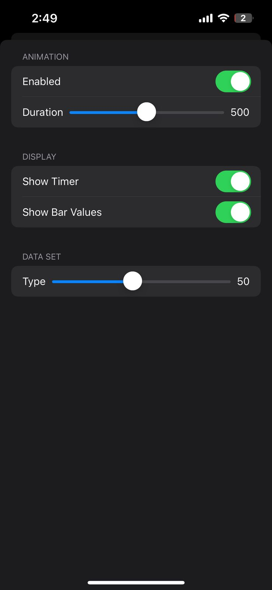

# 📊 Sorting Visualizer

**Sorting Visualizer** is a beautiful, interactive iOS app built with SwiftUI that lets you **watch sorting algorithms in real-time**. Choose from multiple algorithms, customize the sorting speed and dataset size, and enjoy smooth bar graph animations as your array gets sorted step-by-step.

Great for **students, developers, or anyone who enjoys visual learning and satisfying animations**.

---

## 🔧 Features

- ✅ Multiple algorithms: Bubble, Selection, Insertion, Quick, Merge, and more
- 🎨 Live animated bar graph for real-time sorting visualization
- ⚙️ Settings to adjust:
  - Sorting speed (slow to instant)
  - Dataset size (e.g. 10–100 elements)
  - Shuffle/reset dataset
- 🌓 Dark mode support
- 🧪 Built entirely with SwiftUI and MVVM

---

## 📸 Screenshots

> Add your screenshots or GIFs here  
> Recommended size: 1242x2688 (iPhone X-style)

| Sorting Screen | Settings Screen |
|----------------|-----------------|
|  |  |

---
| Working Demo |
|----------------|
|  |

## 🚀 Getting Started

1. Clone the repo:
   ```bash
   git clone https://github.com/yourusername/sorting-visualizer-ios.git
   ```
2. Open the project in Xcode 14+  
3. Run on iOS 15+ device or simulator

---

## 👥 Ideal For

- Students learning sorting algorithms
- Developers building algorithm demos
- Anyone who enjoys watching data get organized 😄

---

## 📄 License

MIT License
